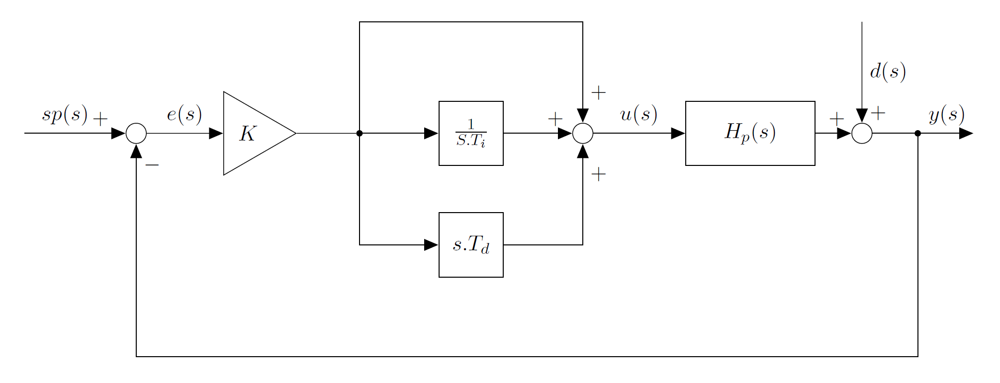

# qPID Digital PID controller library

## Introduction
This library is a digital Proportional-Integrative-Derivative digital controller designed for embedded systems to interact with real systems.

## Principle of work and definitions
### Block Diagram


### Detailed information
Full mathematical description and testing results of this libarary can be found (in spanish) in [kharsansky-quadrotor-control-thesis](kharsansky-quadrotor-control-thesis.pdf).

## Usage example

```C

#include "qPIDs.h"

float setPoint = 0.0;
float sensor = 0.0;
float output = 0.0;


// Example usage for the qPID library for controlling the speed of a simle motor
// The idea is to control the speed of the motor by varing the voltage applied via PWM

float readSensor(void);			// A function that reads the motor speed from a sensor
float readSetPoint(void);		// A function that reads the desired speed from a potentiometer
void setActuator(float);				// A function that sets the PWM output for controlling the motor

void example(void){

	// Declare de new object
	qPID controller;
	
	// Configure settings
	controller.AntiWindup = ENABLED;
	controller.Bumpless = ENABLED;
	
	// Configure de output limits for clamping
	controller.OutputMax = 1.0;
	controller.OutputMin = -1.0;
	
	// Set the rate at the PID will run in seconds
	controller.Ts = 0.005; 
	
	// More settings
	controller.b = 1.0;
	controller.c = 1.0;
	
	// Init de controller
	qPID_Init(&controller);
		
	// Set mode to auotmatic (otherwise it will be in manual mode)
	controller.Mode = AUTOMATIC;

	// Set the tunning constants	
	controller.K = 0.5;
	controller.Ti = 1/0.02;
	controller.Td = 0.0;
	controller.Nd = 4.0;
	
	while (1){
		sensor = readSensor();				// update the process variable
		setPoint = readSetPoint(); 			// update the user desired value
		
		// Update the PID and get the new output
		output = qPID_Process(&controller, setPoint, sensor);
		
		setActuator(output);				// update the actuator input
	}
	
}
```
